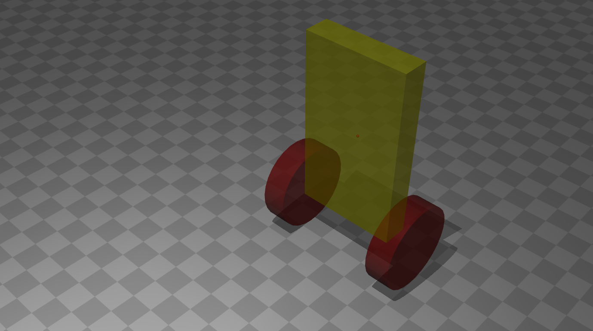
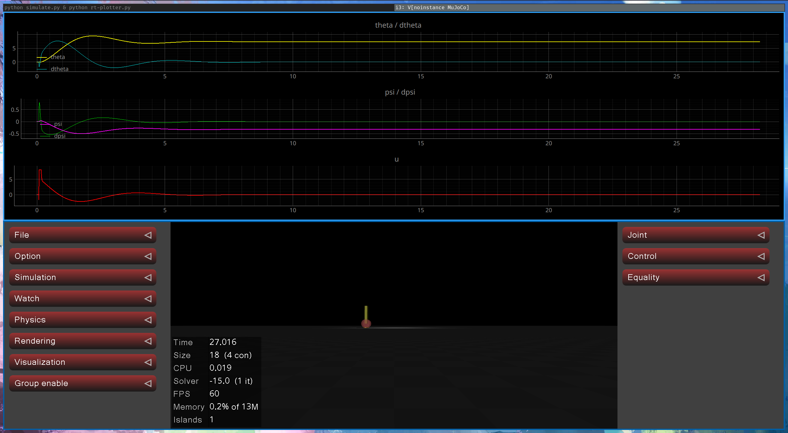

## Segway in mujoco

<!--  -->


## Install

```bash
python3 -m venv ./venv
source venv/bin/activate
pip install -r requirements.txt
```

## Run

To compute K vector (modal control and lqr)
```bash
python model.py
```

To simulate with mujoco
```bash
python simulate.py & python rt-plotter.py
```




## Acknolagments

Thanx to [Antonov Evgeniy](https://github.com/mrclient) for model and modal control.


