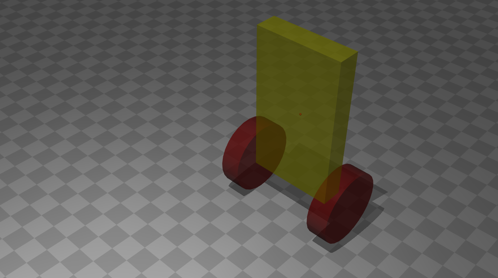
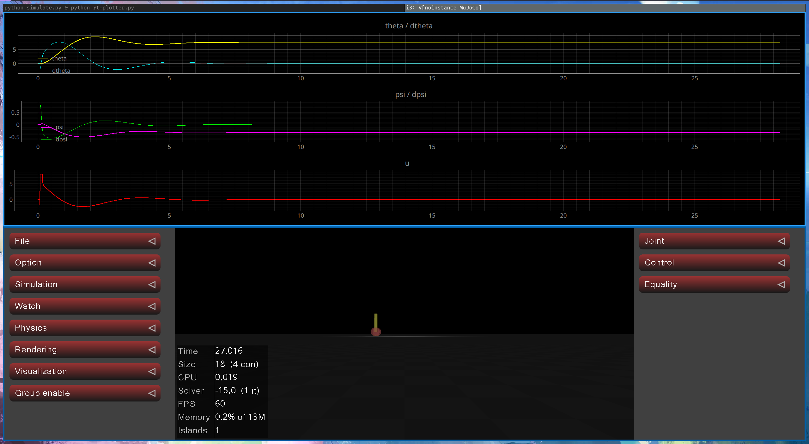

## Segway in mujoco

<!--  -->
<!--  -->


## Install

```bash
python3 -m venv ./venv
source venv/bin/activate
pip install -r requirements.txt

sudo apt-get install build-essential cmake git libzmq3-dev libeigen3-dev 

```

## Run

Model and gains can be found in (lqr, modal control, closed-form MPC)
```bash
python model.py
```

To simulate with mujoco (with system state vizualizetion)
```bash
python simulator.py & python rt-plotter.py
```

Examples of controllers:

1. LQR with standup

    - C++

    ```bash
    g++ controllers/lqr_controller_with_standup.cpp -o controllers/lqr_controller_with_standup -lzmq -O3
    ```
    ```bash
    ./controllers/lqr_controller_with_standup
    ```

    - Python

    ```bash
    python controllers/lqr_controller_with_standup.py
    ```

2. MPC with standup

    - C++
    
        - prerequisites

        Install quadratic problem (osqp) solver
        ```bash
        git clone --recursive -b v1.0.0 https://github.com/oxfordcontrol/osqp.git

        cd osqp && mkdir build && cd build

        cmake -G "Unix Makefiles" ..
        cmake --build .
        cmake --build . --target install
        ```

        Install eigen wrapper for osqp
        ```bash
        git clone --recursive -b v0.11.0 https://github.com/robotology/osqp-eigen.git
        cd osqp-eigen && mkdir build && cd build
        cmake .. && make && make install
        ```

        - building 
        ```bash
        cd controllers/mpc && mkdir build && cd build && cmake .. && make
        ```
        - next, from root dir of the repo, run
        ```bash
        python simulator.py & ./controllers/mpc/build/mpc
        ```




## Acknolagments

Thanx to [Antonov Evgeniy](https://github.com/mrclient) for model and modal control.


